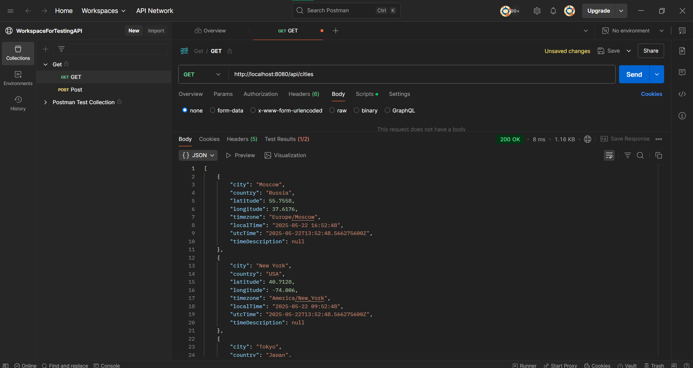
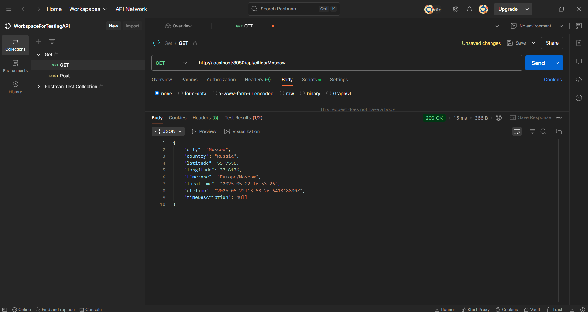
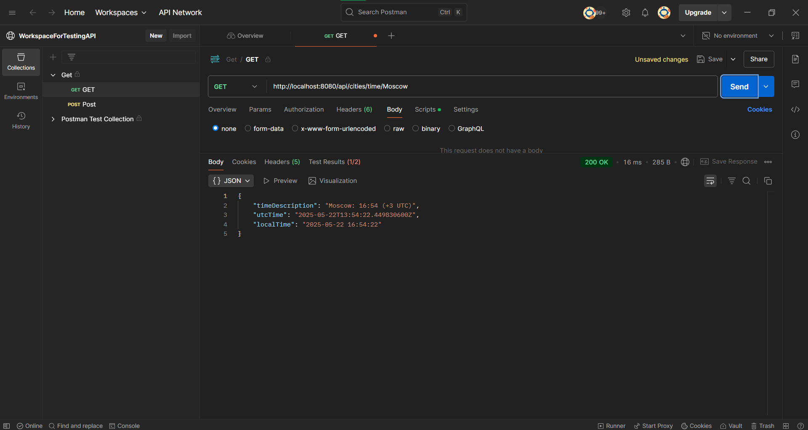
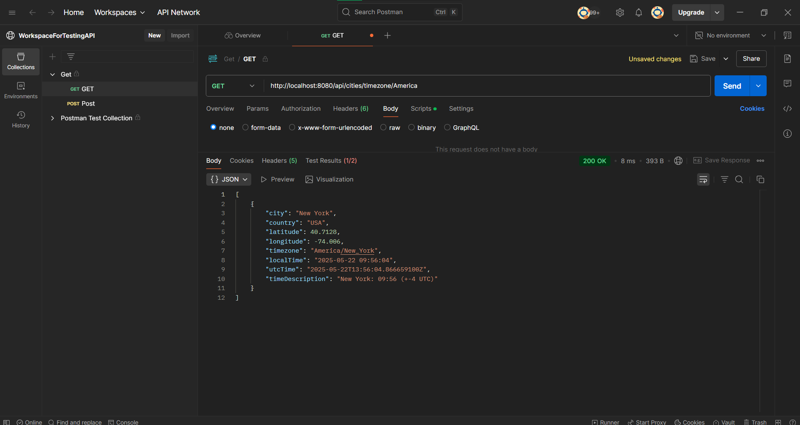

# ЗАДАНИЕ 21
## GET ЗАПРОС

  

## POST ЗАПРОС

  

# ЗАДАНИЕ 22

## 1. Получить список всех городов

  

## 2. Получить конкретный город по имени

  

## 3. Получить только время города

  

## 4. Поиск по стране

  

## 5. Поиск по временной зоне

  

